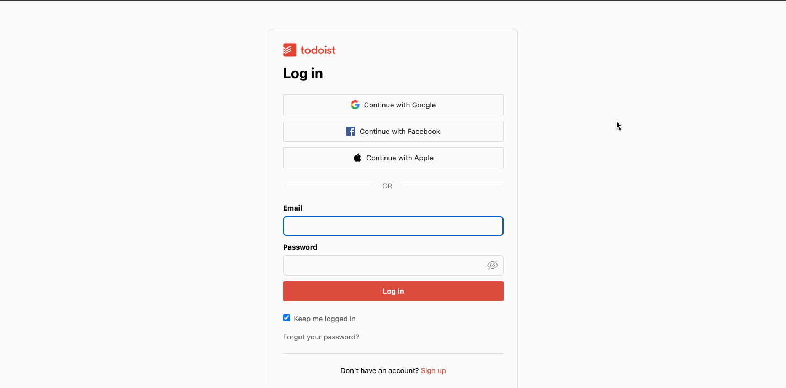

# Test Cafe Framework

Test automation framework with TestCafe tool, creating a simple test to login with invalid credentials and verify error message. Using page object model as design pattern and data provider file to store test data.

Test Cafe config file is set with default timeouts and browser where tests are going to be executed (chrome), and finally a config.js file where set the enviroment where the application is deployed and where the execution is going to be taken.

Page to be test: https://todoist.com/users/showlogin

Scenario: Login with invalid credentials

Test script:
```
fixture`Login`
    .page(config.stage.url)

test('login with invalid credentials', async () => {
    await loginPage.login(data.invalidUser, data.invalidPassword)
    const isErrorMessageVisible = await loginPage.errorMessage.visible
    const errorMessageText = await loginPage.errorMessage.innerText
    await t
        .expect(isErrorMessageVisible)
        .ok('Error message was not displayed.')
        .expect(errorMessageText)
        .eql(data.errorMessage, 'Wrong error message!')
})

```
\


\
Expected Result: Validate correct error message is be displayed
`Wrong email or password.`
